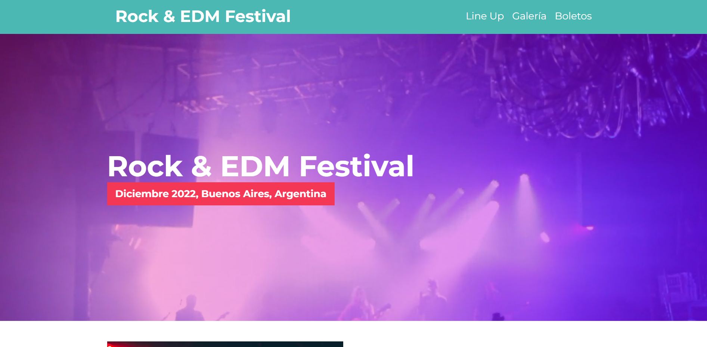
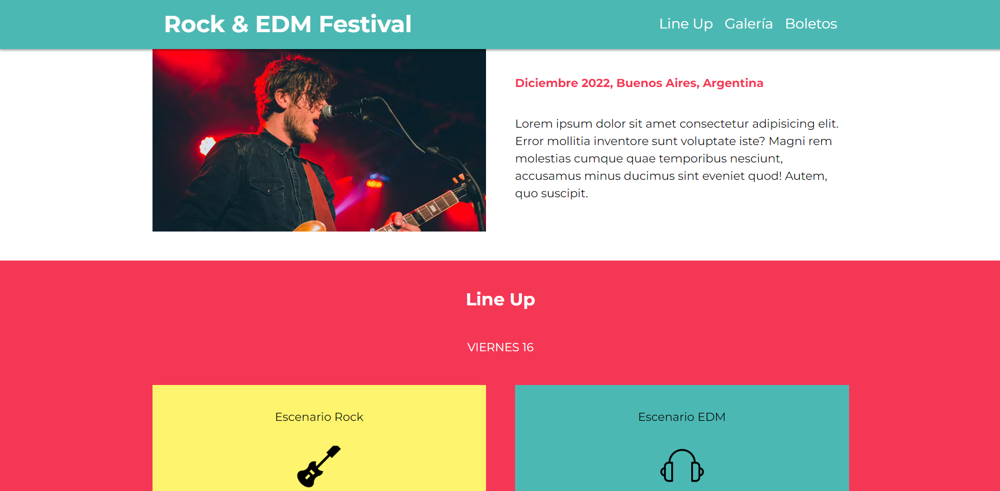
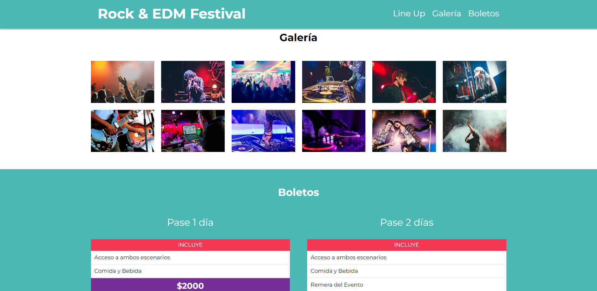
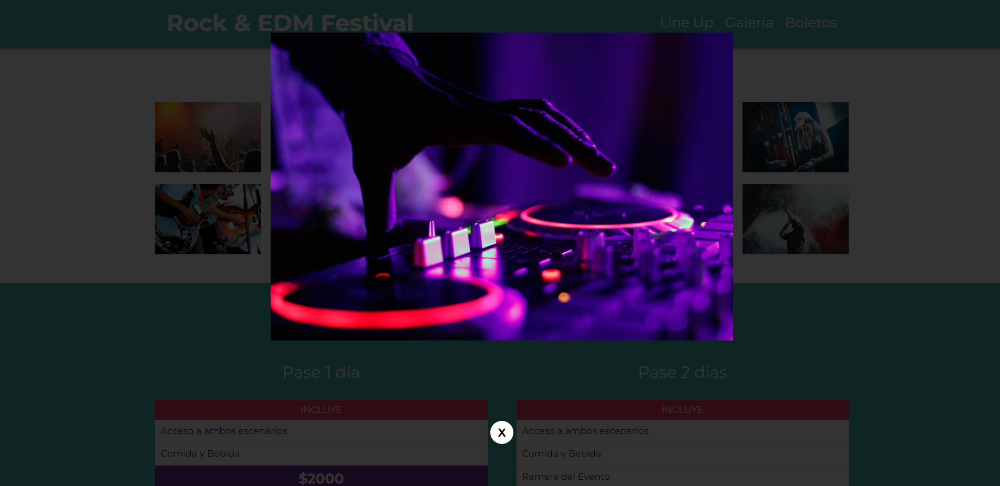

# Festival-de-musica
### Front-end

## ¿Qué es?
Es una página web sencilla desarrollada con HTML, SASS y Gulp. Es un modelo de lo que podría ser la página de un festival de música, con información sobre el mismo, imagenes y más.
Lo realice con el curso de Udemy [Desarrollo Web Completo con HTML5, CSS3, JS AJAX PHP y MySQL](https://www.udemy.com/course/desarrollo-web-completo-con-html5-css3-js-php-y-mysql/)

## Capturas

    
    
    
    

